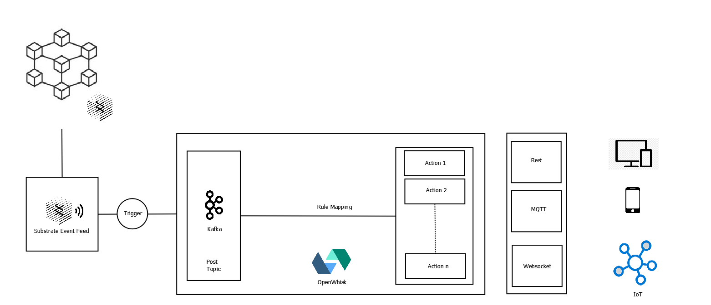

# Overview

### Introduction

Aurras is a middleware that acts as an event processor and a low code workflow orchestration platform. Aurras is being pitched as a next-generation system for enabling decentralized push notifications. This middleware solution listens to events from blockchain applications and propagates them to a registered pool of MQTT brokers. The broader architecture consists of a parachain from which the middleware listens for the events.

### Architecture

### Components

* [Event Feed](components/event-feed/)
* [Event Manager](components/event-manager.md)
* Workflow Composer
* Web API Gateway and Backend Service

